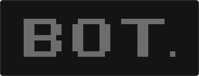

<p align="center">
  
</p>

<h1 align="center">Bot</h1>

<p align="center">
  One fast, readable terminal interface for AI coding agents.
</p>

Bot gives coding agents one consistent terminal interface. Providers keep control
of authentication, models, tools, approvals, and conversation storage. Bot does
not copy provider credentials or merge conversations across providers.

## Install

### macOS and Linux

```sh
curl --proto '=https' --tlsv1.2 -LsSf https://raw.githubusercontent.com/woosal1337/bot/main/scripts/install.sh | sh
```

The installer downloads the matching production binary, verifies its SHA-256
checksum, and installs `bot` in `~/.local/bin`. It does not compile the project.

### Windows PowerShell

```powershell
irm https://raw.githubusercontent.com/woosal1337/bot/main/scripts/install.ps1 | iex
```

The Windows installer verifies the release checksum, installs `bot.exe` for the
current user, and adds its directory to the user `PATH`.

### Update an installed copy

Bot 1.0.2 and earlier need one installer update. Close Bot, then run the install
command for your operating system again. Newer releases include these commands:

```sh
bot update --check
bot update
```

Bot installs only the latest stable release. It checks the target, download
size, GitHub asset digest, `SHA256SUMS`, and staged binary version. The final
replacement is atomic on macOS and Linux. Windows finishes the replacement
after the update command exits. Existing sessions keep their current version
until they restart.

Bot never installs an update during startup. A commit on `main` does not update
an installed copy. The release workflow must publish a new version first. See
[`docs/updating.md`](docs/updating.md) for the complete update and recovery
process.

The one-line install commands fetch their scripts from `main`. The
release archive is checked, but the script itself is not checked before it
runs. Each release also includes the installer scripts in `SHA256SUMS`. Download
the script and the checksum file from the release when you must check both.

### Build from source

Install Rust 1.94 and Protocol Buffers, then run:

```sh
cargo build --locked --profile release-dist -p xai-grok-pager-bin --bin bot --features release-dist
install -m 0755 target/release-dist/bot ~/.local/bin/bot
```

## Start

Sign in with the provider's official client, then start Bot from a project:

```sh
codex login
cd your-project
bot
```

Bot selects Codex by default. Select a provider explicitly when needed:

```sh
bot --provider codex
bot --provider grok
```

Type `/` in the composer to open all available commands. Useful commands include
`/model`, `/effort`, `/permissions`, `/login`, `/logout`, `/usage`, `/resume`,
`/fork`, `/rewind`, `/compact`, `/provider`, and `/settings`.

See [usage telemetry](docs/usage-telemetry.md) for the exact account and context
metrics that each provider supplies.

In `/settings`, open Models → Default effort to save an effort level for the
selected provider and model. Bot uses it for new conversations only. Choose
“Model default” to clear it. `--effort` takes priority for one launch.

## Current support

Codex is the production-ready provider in Bot 1.0.0. It uses the supported Codex
app-server protocol and the provider-owned Codex login and configuration. Text,
images, streamed responses, reasoning, tools, approvals, models, effort, account
status, rate limits, MCP servers, skills, hooks, sessions, and native conversation
actions are connected.

The imported Grok Build runtime remains available as an experimental provider.
Claude and isolated multi-account profiles are planned. See
[`docs/release-status.md`](docs/release-status.md) for the exact remaining work.

## Privacy and security

- Bot does not copy or migrate credentials between providers.
- Codex keeps its login and conversations in the official Codex client. The
  experimental Grok runtime uses its own Grok credential and session stores.
- Provider-specific data stays behind its adapter.
- Unknown provider data is retained only as opaque diagnostic metadata.
- The Codex adapter uses the supported Codex app-server protocol. Bot does not
  identify itself as an official provider client.

Report a vulnerability through the repository's private security reporting
form. See [`SECURITY.md`](SECURITY.md).

## Releases

Version tags build production binaries for Linux, macOS, and Windows. Each
release includes `SHA256SUMS`, license notices, and GitHub build provenance.

The installers verify the archive checksum. On Linux, you can also verify a
downloaded archive yourself:

```sh
sha256sum --check SHA256SUMS --ignore-missing
gh attestation verify bot-*.tar.gz --repo woosal1337/bot
```

## Development

Run the release checks:

```sh
cargo fmt --all --check
cargo clippy --workspace --all-targets --all-features -- -D warnings
BOT_PROVIDER=grok cargo test --workspace --all-features -- --test-threads=1
```

Bot is licensed under Apache-2.0. It includes modified Grok Build source under
the same license. See [`NOTICE`](NOTICE) and
[`THIRD-PARTY-NOTICES`](THIRD-PARTY-NOTICES).
